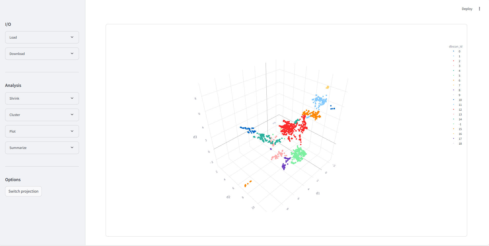

# Streamlit Embedding Projector

**General disclaimer** This repository was created for use by CDC programs to collaborate on public health related projects in support of the [CDC mission](https://www.cdc.gov/about/organization/mission.htm).  Github is not hosted by the CDC, but is a third party website used by CDC and its partners to share information and collaborate on software.

## Overview
APP_NAME_HERE is a web app, written in Streamlit, for generating and analyzing text embeddings. Broadly, the app recreates the analytic flow of embeddings-based topic-modeling algorithms like [BERTopic](https://maartengr.github.io/BERTopic/index.html), allowing users to generate embeddings, reduce their dimensionality, and cluster them in the dimensionally-reduced space. Like BERTopic, the app can generate lists of potential topics using a cluster-based variant of [TF-IDF](https://en.wikipedia.org/wiki/Tf–idf), but, by way of LLM-based iterative summarization, it can also generate free-text summaries of the information in the clusters. The app makes these summaries, as well as any data artifacts generated during a session, available for download and further analysis offline.

## User Interface
The main user interface is divided into two main components: a viewing pane for rendering the embeddings in 3- or 2-d space, and a sidebar for working with the embeddings. The sidebar is divided into three subsections: `I/O`, for loading and downloading session data; `Analysis`, for generating, shrinking, clustering, and summarizing the embeddings; and `Options`, for changing the current data projection view and managing advanced session settings.

Some of the expander menus are available at the beginning of a session, while others will only appear after certain artifacts have been generated, like by uploading a dataset or by running a clustering algorithm. If something doesn't appear when or where you think it should, though, please open an issue on the repository so we can take a look.

## Getting Started
### Data Loading
Users can start a work session with two kinds of input data: a CSV file holding the text to be embedded in a single column (Option 1); or a CSV file holding a set of premade embeddings (Option 2a), in which case they can also upload a CSV file holding line-level metadata corresponding to the embeddings (Option 2b). For files that don't contain premade embeddings, users will be prompted to choose a column holding the text they would either like to embed (Option 1) or to use for generating cluster keywords and free-text summaries (2b) for premade embeddings after running a clustering algorithm. In all cases, the input files should have headers, so that the first row comprises column names and not data to be analyzed.

### Embedding Generation
APP_NAME_HERE currently only supports a single embedding model: OpenAI's `ada-002`, which it accesses over the Azure OpenAI API. Support for more models, including those offered by HuggingFace, will be added in the future.

### Dimensionality Reduction
APP_NAME_HERE implements three algorithms for reducing the size of the raw text embeddings: principal component analysis ([PCA](https://en.wikipedia.org/wiki/Principal_component_analysis)), uniform manfiold approximation and projection ([UMAP](https://umap-learn.readthedocs.io/en/latest/)), and t-distributed stochastic neighbor embedding ([t-SNE](https://en.wikipedia.org/wiki/T-distributed_stochastic_neighbor_embedding)).

### Cluster Analysis
The app supports four clustering algorithms: [k-means](https://en.wikipedia.org/wiki/K-means_clustering), [DBSCAN](https://en.wikipedia.org/wiki/DBSCAN), [HDBSCAN](https://hdbscan.readthedocs.io/en/latest/how_hdbscan_works.html), and [agglomerative clustering](https://en.wikipedia.org/wiki/Hierarchical_clustering), all implemented with `scikit-learn`. 

### Downloading Artifacts
At any point during a work session, users can download whatever data artifacts they've generated so far. Download buttons will appear for the raw embeddings, reduced-dimensionality embeddings, cluster keywords, and LLM-generated cluster summary report as they are created by the app. Cluster IDs are attached to rows in the files holding the reduced embeddings and cluster keywords, 

## Public Domain Standard Notice
This repository constitutes a work of the United States Government and is not
subject to domestic copyright protection under 17 USC § 105. This repository is in
the public domain within the United States, and copyright and related rights in
the work worldwide are waived through the [CC0 1.0 Universal public domain dedication](https://creativecommons.org/publicdomain/zero/1.0/).
All contributions to this repository will be released under the CC0 dedication. By
submitting a pull request you are agreeing to comply with this waiver of
copyright interest.

## License Standard Notice
The repository utilizes code licensed under the terms of the Apache Software
License and therefore is licensed under ASL v2 or later.

This source code in this repository is free: you can redistribute it and/or modify it under
the terms of the Apache Software License version 2, or (at your option) any
later version.

This source code in this repository is distributed in the hope that it will be useful, but WITHOUT ANY
WARRANTY; without even the implied warranty of MERCHANTABILITY or FITNESS FOR A
PARTICULAR PURPOSE. See the Apache Software License for more details.

You should have received a copy of the Apache Software License along with this
program. If not, see http://www.apache.org/licenses/LICENSE-2.0.html

The source code forked from other open source projects will inherit its license.

## Privacy Standard Notice
This repository contains only non-sensitive, publicly available data and
information. All material and community participation is covered by the
[Disclaimer](https://github.com/CDCgov/template/blob/master/DISCLAIMER.md)
and [Code of Conduct](https://github.com/CDCgov/template/blob/master/code-of-conduct.md).
For more information about CDC's privacy policy, please visit [http://www.cdc.gov/privacy.html](http://www.cdc.gov/privacy.html).

## Contributing Standard Notice
Anyone is encouraged to contribute to the repository by [forking](https://help.github.com/articles/fork-a-repo)
and submitting a pull request. (If you are new to GitHub, you might start with a
[basic tutorial](https://help.github.com/articles/set-up-git).) By contributing
to this project, you grant a world-wide, royalty-free, perpetual, irrevocable,
non-exclusive, transferable license to all users under the terms of the
[Apache Software License v2](http://www.apache.org/licenses/LICENSE-2.0.html) or
later.

All comments, messages, pull requests, and other submissions received through
CDC including this GitHub page are subject to the [Presidential Records Act](http://www.archives.gov/about/laws/presidential-records.html)
and may be archived. Learn more at [http://www.cdc.gov/other/privacy.html](http://www.cdc.gov/other/privacy.html).

## Records Management Standard Notice
This repository is not a source of government records, but is a copy to increase
collaboration and collaborative potential. All government records will be
published through the [CDC web site](http://www.cdc.gov).

## Related documents

* [Open Practices](open_practices.md)
* [Rules of Behavior](rules_of_behavior.md)
* [Thanks and Acknowledgements](thanks.md)
* [Disclaimer](DISCLAIMER.md)
* [Contribution Notice](CONTRIBUTING.md)
* [Code of Conduct](code-of-conduct.md)

## Additional Standard Notices
Please refer to [CDC's Template Repository](https://github.com/CDCgov/template)
for more information about [contributing to this repository](https://github.com/CDCgov/template/blob/master/CONTRIBUTING.md),
[public domain notices and disclaimers](https://github.com/CDCgov/template/blob/master/DISCLAIMER.md),
and [code of conduct](https://github.com/CDCgov/template/blob/master/code-of-conduct.md).
